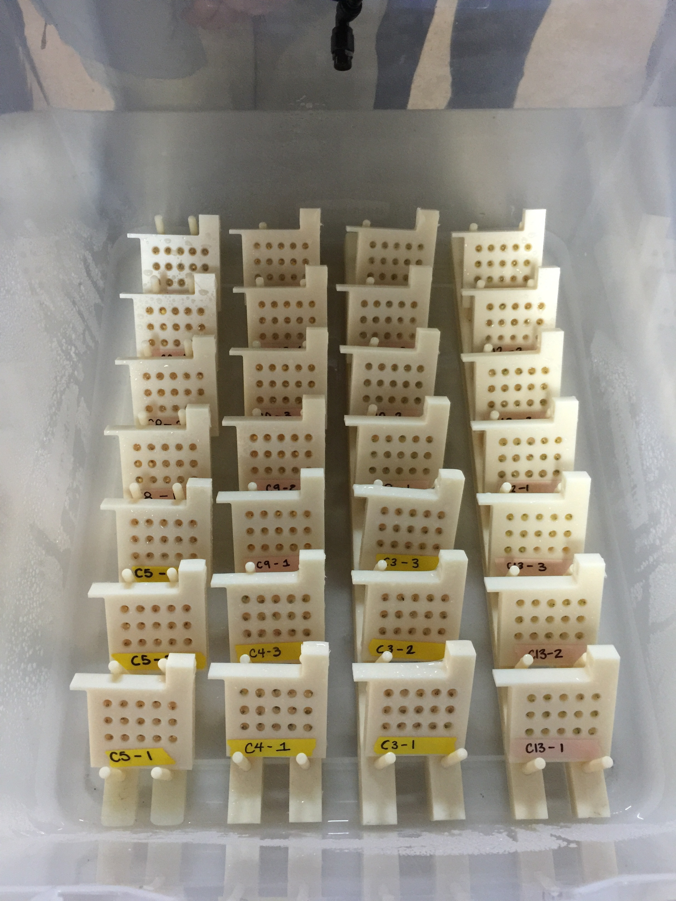

# Welcome, friends!

Please go forth and scroll down to begin your journey though my data re-analysis assignment for AN 597. Here I have provided some basic background and performed/replicated all analyses in a submitted manuscript, Warkentin et al. 201-tbd. The original paper and full dataset used are uploaded onto the repository in pdf and csv form, respectively.

## Introduction

 

Red-eyed treefrogs, *Agalychnis callidryas* (pictured above as an adult and a juvenile), commonly lay their eggs (pictured below left) on leafy substrate overhanging tropical ponds . 

 

These arboreal embryos can hatch prematurely to escape from egg predators, such as the parrot snake (pictured above right), cued by vibrations in attacks. 

It is known that young embryos modulate hatching based on multiple frequency and temporal properties of cues, reducing false alarms that unnecessarily expose them to risk in the water. 

### Hypothesis

Because the cost of false alarms decreases developmentally we hypothesized that, if sampling costs are high or stimuli ambiguous, older embryos would accept more false alarms. 

## Methods



### Experimental design
We assessed changes in sensitivity to sampling costs using vibration playbacks (to trays of embryos, pictured above) at two developmental stages. We designed sets of 3 stimuli, based on prior results with younger embryos, so one elicited high hatching and two elicited similarly low hatching, but sampling costs differed between low-hatching stimuli. 

### Statistics
The original paper and full dataset used are uploaded onto the repository in pdf and csv form, respectively. I will replicate all analyses included in the paper, including:  
* mann-whitney-wilcoxon tests  
* two-sample t-tests  
* wilcoxon rank sum tests  
* binomial GLMs  
* interaction plots  
* ANOVAs  
* AIC model comparisons  

### Code preparation

#### File logistics

First, we will clear the environment and set our working directory: 

```{r}
rm(list=ls()) #clear environment
setwd('/Users/juliejung/Documents/GitHub/AN 597/data-reanalysis-assignment') #set working directory       
```

#### User Defined Functions

Here we'll define some functions that will help us later. The following function will give us the mode: 

```{r}
# gives mode
Mode <- function(x) {
  ux <- unique(x)
  ux[which.max(tabulate(match(x, ux)))]
}

```

#### Load packages

Here, we install and load packages that we'll need later on in the code. 
NOTE: uncomment as needed. 

```{r}
# install.packages("stargazer")
# install.packages("knitr")
# install.packages("dplyr")
# install.packages("curl")
# install.packages("sciplot")
# install.packages("ggplot2")
# install.packages("MASS")
# install.packages("multcomp")
# install.packages("AICcmodavg")
# install.packages("car")

library("stargazer")
library("knitr")
library("dplyr")
library("curl")
library("sciplot")
library("ggplot2")
library("MASS")
library("multcomp")
library("AICcmodavg")
library("car")

```

#### Read in data

Next, we want to read in the relevant datafile (from the data-reanalysis-assignment repo) and show a few lines of raw data in your output (e.g., using head()).

```{r}
f <- curl("https://raw.githubusercontent.com/jamjulie/data-reanalysis-assignment/master/WarkentinJungRuedaMcDaniel-DataForDeposit.csv")
data <- read.csv(f, header = TRUE, sep = ",", stringsAsFactors = TRUE)
head(data)
```

## Results, part I

Now that we've gone through all our preparations, we can run analyses and report replicated results! The following results follow the order of presented results in the paper (pdf in repo).  

First, we will check there are at least 8 eggs per tray. 

```{r}
min(data$TestEggs, na.rm=T) 
```

Now let's look at the structure of our data, and make sure the variables are defined as we want them to be defined. 

```{r, warning=FALSE}
str(data)
data$GutCoilStage<-as.numeric(as.character(data$GutCoilStage))
data$T3length<-as.numeric(as.character(data$T3length))
data$ProportionHatched<-as.numeric(as.character(data$ProportionHatched))
data$STIMULUS<-as.factor(data$STIMULUS)
data$FirstHatch.s. <-as.numeric(as.character(data$FirstHatch.s. ))
data$FirstHatch.cycles. <-as.numeric(as.character(data$FirstHatch.cycles. ))
```

Here let's subset the data into 2 age groups: younger and older. 

```{r, warning=FALSE}
younger<-subset(data, Age.d.==5.2, na.rm=T)
older<-subset(data, Age.d.==5.7, na.rm=T)
```

Since the paper reports the mode of stages for each age category, let's find that: 

```{r}
Mode(younger$GutCoilStage)
Mode(older$GutCoilStage)
```

> Younger embryos showed a range of stages from intact yolks to curved furrows while older embryos had straight furrows to full coils (N = 39 and 42; modes: straight furrow(1) and full coil(3)). 

#### Summarize the data

Here we'll create a table summary of statistics for hatching rates (in proportion hatched) for each age category, grouped by stimulus treatment. We use the {dplyr} package to summarize our data. 

```{r}
younger_errorstats_g8<-
  younger %>%
  group_by(STIMULUS) %>%
  summarize(count = n(),
            mean = mean(ProportionHatched),
            SD = sd(ProportionHatched), 
            SE = sd(ProportionHatched)/sqrt(n())
            )
younger_errorstats_g8$AgeGroup <- 5.2
kable(younger_errorstats_g8,title="Mean & SD & SE",digits=3)

older_errorstats_g8<-
  older %>%
  group_by(STIMULUS) %>%
  summarize(count = n(),
            mean = mean(ProportionHatched),
            SD = sd(ProportionHatched), 
            SE = sd(ProportionHatched)/sqrt(n())
            )
older_errorstats_g8$AgeGroup <- 5.7
kable(older_errorstats_g8,title="Mean & SD & SE",digits=3)
```

Should we use parametric or non-parametric tests?

```{r}
hist(data$GutCoilStage) #non parametric
hist(younger$GutCoilStage)
hist(older$GutCoilStage)
```

We'll use mann-whitney-wilcoxon test because our 2 data samples (younger and older) are independent/come from distinct populations, so the samples do not affect each other. 

Also because our data are non-parametric. 

```{r, warning=FALSE}
wtest<-wilcox.test(data$GutCoilStage~data$Age.d., mu = 0, alt="two.sided", paired = F, conf.int=T, conf.level=0.95)
qnorm(wtest$p.value) #z-value to report
wtest
```
 
> Younger embryos showed a range of stages from intact yolks to curved furrows while older embryos had straight furrows to full coils (N = 39 and 42; modes: straight furrow(1) and full coil(3); Wilcoxon test, Z=6.606223, P =1.97e-11). 

Moving right along, here we'll calculation the total lengths (mean and se) of hatchlings in each age group. 

```{r}
mean(younger$MeanLength)
mean(older$MeanLength)

se(younger$MeanLength)
se(older$MeanLength)
```

> Embryos grew between test ages. Hatchling total length increased from 11.1 ± 0.07 to 11.6 ± 0.05 mm (mean ± SE, N = 39 and 42 trays respectively).  

Since the data are normal and we get equal variances, we'll perform a t-test. 

```{r}
hist(data$MeanLength)#normal
var.test(younger$MeanLength, older$MeanLength) # equal variances
t.test(younger$MeanLength, older$MeanLength, alternative=c("two.sided"), paired=FALSE, var.equal=TRUE, conf.level=0.95)
```

> Embryos grew between test ages. Hatchling total length increased from 11.1 ± 0.07 to 11.6 ± 0.05 mm (mean ± SE, N = 39 and 42 trays respectively; t-test, t79 = 6.4871, P =7.018e-9; Fig. 4B). 

Embryos also hatched spontaneously between test ages, so we want to calculate some means and SEs for spontaneous hatching before the test period. 

```{r}
mean(younger$AlreadyHatchedorRuptured)
se(younger$AlreadyHatchedorRuptured)
mean(older$AlreadyHatchedorRuptured)
se(older$AlreadyHatchedorRuptured)
```

> From trays tested, more of the older embryos had hatched spontaneously before the test period (0.9 ± 0.1 vs. 0.5 ± 0.1 embryos per tray). 

Since the data are non-parametric, we'll perform a mann-whitney test: 

```{r}
hist(data$AlreadyHatchedorRuptured)#non-parametric, mann-whitney
wtest<-wilcox.test(data$AlreadyHatchedorRuptured~data$Age.d., mu = 0, alt="two.sided", paired = F, conf.int=T, conf.level=0.95)
qnorm(wtest$p.value) #z-value to report
wtest
```

> From trays tested, more of the older embryos had hatched spontaneously before the test period (0.9 ± 0.1 vs. 0.5 ± 0.1 embryos per tray; Wilcoxon test, Z=2.439, P = 0.0074) and relatively fewer of the trays with older eggs had sufficient individuals to attempt setup (KMW unquantified personal observation). 


Now we'll look at the number of embryos that hatched at set up: 

```{r}
# hatching from set up
mean(younger$HatchedinSetup)
se(younger$HatchedinSetup)
mean(older$HatchedinSetup)
se(older$HatchedinSetup)
```
> More of the older embryos hatched during setup and acclimation (2.5 ± 0.3 vs. 0.9 ± 0.2 per tray). 

Since the data are non-parametric, we'll perform a mann-whitney test: 

```{r}
hist(data$HatchedinSetup)#non-parametric, mann-whitney
wtest<-wilcox.test(data$HatchedinSetup~data$Age.d., mu = 0, alt="two.sided", paired = F, conf.int=T, conf.level=0.95)
qnorm(wtest$p.value) #z-value to report
wtest
```

> More of the older embryos hatched during setup and acclimation (2.5 ± 0.3 vs. 0.9 ± 0.2 per tray; Wilcoxon test, Z=404.5, P = 5.085e-5). 


We want to calculate some means and ses for the number of test eggs per tray in older vs. younger. 

```{r}
#smaller number of test eggs per tray in older than younger
mean(younger$TestEggs)
se(younger$TestEggs)
mean(older$TestEggs)
se(older$TestEggs)

min(younger$TestEggs)
max(younger$TestEggs)
min(older$TestEggs)
max(older$TestEggs)
```
> This resulted in smaller numbers of test eggs per tray (older 11.5 ± 0.3, younger 13.5 ± 0.2, range 8–15 at both ages). 

Since the data are non-parametric, we'll perform a mann-whitney test: 

```{r}
hist(data$TestEggs)#non-parametric, mann-whitney
wtest<-wilcox.test(data$TestEggs~data$Age.d., mu = 0, alt="two.sided", paired = F, conf.int=T, conf.level=0.95)
qnorm(wtest$p.value) #z-value to report
wtest
```
> This resulted in smaller numbers of test eggs per tray (Wilcoxon test, Z=4.361872, P =6.448e-6; older 11.5 ± 0.3, younger 13.5 ± 0.2, range 8–15 at both ages). 

## Results, part II: Visualizations

Next, we want to know whether age, stimulus, and/or their interaction affected the hatching response of embryos in playbacks 

We'll do this by performing a binomial GLM: 
```{r}
#binomial glm
glm1<-glm(cbind(X10minHatch,TestEggs)~Age.d., family=binomial(logit), data=data)
glm2<-glm(cbind(X10minHatch,TestEggs)~STIMULUS, family=binomial(logit), data=data)
glm3<-glm(cbind(X10minHatch,TestEggs)~Age.d.+STIMULUS, family=binomial(logit), data=data)
glm4<-glm(cbind(X10minHatch,TestEggs)~Age.d.*STIMULUS, family=binomial(logit), data=data)

glms<-list(glm1, glm2, glm3, glm4)
aictab(glms)

Anova(glm4)
```

> Age, stimulus, and their interaction affected the hatching response of embryos in playbacks (Fig. 6A). Older embryos hatched more than did younger ones (binomial GLM, age effect: χ2 = 107.71, df = 1, P < 0.0001), and the LF stimulus elicited the strongest hatching response (stimulus effect: χ2 = 57.57, df = 2, P < 0.0001). However, the significant age × stimulus interaction revealed that the developmental increase in hatching was not uniform across stimuli (interaction effect: χ2 = 12.55, df = 2, P = 0.0019). 

This is the plot for our proportion hatched data (Figure 6 in paper)

```{r}
interaction.plot(data$Age.d., data$STIMULUS, data$ProportionHatched, 
                 leg.bty="0", pch=c(18,24), 
                 ylab="Proportion hatched", 
                 xlab="Age (days)", 
                 trace.label="")
```

The image of the figure from the original paper that I'm replicating is included in a folder called “img” within my repo and embedded here: 

Specifically, we're looking at part A of the figure. 


ALTERNATIVELY, we can use ggplot to create a much prettier plot, with standard errors. 

```{r}
younger_errorstats_g8$AgeGroup<-as.factor(younger_errorstats_g8$AgeGroup)
older_errorstats_g8$AgeGroup<-as.factor(older_errorstats_g8$AgeGroup)
combined_errorstats<- rbind(younger_errorstats_g8, older_errorstats_g8)
```

The following code creates our figure:
```{r}
ggplot(data=combined_errorstats, aes(x=AgeGroup, y=mean, colour=STIMULUS)) + 
  geom_point(size=3) +
  geom_errorbar(data=combined_errorstats, aes(ymin=mean-SE, ymax=mean+SE), width=0.05)+
  theme_bw(20)+
  ylab("Proportion of tray hatched\n")+
  xlab("\n Age (d)")+
  annotate("text", x = 1, y = 0.2, label = "N=13")+
  annotate("text", x = 2, y = 0.4, label = "N=14")
```

Moving on: Here we perform separate binomial GLMs at each age, with grouped categories of treatment stimuli. 

```{r}
#binomial glm for YOUNGER
glm2<-glm(cbind(X10minHatch,TestEggs)~STIMULUS, family=binomial(logit), data=younger)
Anova(glm2)

#binomial glm for OLDER
glm2<-glm(cbind(X10minHatch,TestEggs)~STIMULUS, family=binomial(logit), data=older)
Anova(glm2)
```
> Younger embryos showed equally little response to both the HF and LS stimuli but a substantial hatching response to the LF stimulus (Fig. 6A, stimulus effect: χ2 = 57.57, df = 2, P < 0.0001; HF–LS contrast χ2  = 1.48, P = 0.22; (HF+LS)–LF contrast χ2 = 370 56.75, P < 0.0001). In contrast, older embryos showed similarly strong hatching responses to both LF and LS stimuli and a weaker response to the HF stimulus (stimulus effect: χ2 = 73.84, df = 2, P < 0.0001; LF–LS contrast χ2 = 2.46, P = 0.12; (LF+LS)–HF contrast χ2 = 71.61, P < 0.0001). 

## Results, part III: Latency Analysis

Because risk in predator attacks probably accrues as a function of time, 
but information from temporal properties accrues as a function of cycles 
we conducted analyses of latency measured both in time (seconds) 
and in cycles (dividing time by the cycle length of the stimulus). 

```{r}
min(data$FirstHatch.s., na.rm=T)
max(data$FirstHatch.s., na.rm=T)
```
> In trays where hatching occurred, the latency until the first embryo hatched ranged from 9–420 s. 

Are our data parametric?

```{r}
hist(data$FirstHatch.s.) #nonparametric
hist(data$FirstHatch.cycles.) #nonparametric
hist(log(data$FirstHatch.s.)) #parametric!
hist(log(data$FirstHatch.cycles.)) #parametric!
```
Since they are, we can use ANOVAs of log-transformed data to test for 
effects of age, stimulus and age-by-stimulus interaction 
on the latency to hatch. 

```{r}
# IN SECONDS, Anova
aov1 <- aov(log(FirstHatch.s.) ~ Age.d.*STIMULUS, data=data)
summary(aov1)
# IN CYCLES, Anova
aov2 <- aov(log(FirstHatch.cycles.) ~ Age.d.*STIMULUS, data=data)
summary(aov2)
```
> Latency varied among stimuli and decreased with age, with a marginally non-significant interaction effect (Fig. 6B,C). This pattern held whether measuring latency in seconds or in cycles of vibration (seconds: age, F1,58 = 39.52, P < 0.0001; stimulus, F2,58 = 13.72, P < 0.0001; interaction, F2,58 = 2.91, P = 0.0625; cycles: age, F1,58 = 49.54, P < 0.0001; stimulus, F2,58 = 71.89, P < 0.0001; interaction, F2,58 = 2.91, P = 0.0625).

Alternatively, we can use GLMs: 

```{r}
# IN SECONDS, GLM METHOD
glm1<-glm(FirstHatch.s.~Age.d., family=gaussian(link = "identity"), data=data)
glm2<-glm(FirstHatch.s.~STIMULUS, family=gaussian(link = "identity"), data=data)
glm3<-glm(FirstHatch.s.~Age.d.+STIMULUS, family=gaussian(link = "identity"), data=data)
glm4<-glm(FirstHatch.s.~Age.d.*STIMULUS, family=gaussian(link = "identity"), data=data)

glms<-list(glm1, glm2, glm3, glm4)
aictab(glms)

Anova(glm4)
```

Here we plot the latencies for the first embryo in each tray to hatch: 

```{r}
LtoH_younger_errorstats_g8<-
  younger %>%
  group_by(STIMULUS) %>%
  summarize(count = n(),
            mean = mean(FirstHatch.s., na.rm=T),
            SD = sd(FirstHatch.s., na.rm=T), 
            SE = sd(FirstHatch.s., na.rm=T)/sqrt(n())
            )
LtoH_younger_errorstats_g8$AgeGroup <- "5.2"
kable(LtoH_younger_errorstats_g8,title="Mean & SD & SE",digits=3)

LtoH_older_errorstats_g8<-
  older %>%
  group_by(STIMULUS) %>%
  summarize(count = n(),
            mean = mean(FirstHatch.s., na.rm=T),
            SD = sd(FirstHatch.s., na.rm=T), 
            SE = sd(FirstHatch.s., na.rm=T)/sqrt(n())
            )
LtoH_older_errorstats_g8$AgeGroup <- "5.7"
kable(LtoH_older_errorstats_g8,title="Mean & SD & SE",digits=3)
```

Now we can make the plot! 

```{r}
LtoH_combined_errorstats<- rbind(LtoH_younger_errorstats_g8, LtoH_older_errorstats_g8)
```

The following code creates our figure:
```{r}
ggplot(data=LtoH_combined_errorstats, aes(x=AgeGroup, y=mean, colour=STIMULUS)) + 
  geom_point(size=3) +
  geom_errorbar(data=LtoH_combined_errorstats, aes(ymin=mean-SE, ymax=mean+SE), width=0.05)+
  theme_bw(20)+
  ylab("Latency to hatch (seconds)\n")+
  xlab("\n Age (d)")
```

The image of the figure from the original paper that I'm replicating is included in a folder called “img” within my repo and embedded here: 

Specifically, we've replotted part B of this figure. 


Recall that because risk in predator attacks probably accrues as a function of time, 
but information from temporal properties accrues as a function of cycles, 
we conducted analyses of latency measured both in time (seconds) 
and in cycles (dividing time by the cycle length of the stimulus). 

```{r}
## IN CYCLES, GLM METHOD
glm1<-glm(FirstHatch.cycles.~Age.d., family=gaussian(link = "identity"), data=data)
glm2<-glm(FirstHatch.cycles.~STIMULUS, family=gaussian(link = "identity"), data=data)
glm3<-glm(FirstHatch.cycles.~Age.d.+STIMULUS, family=gaussian(link = "identity"), data=data)
glm4<-glm(FirstHatch.cycles.~Age.d.*STIMULUS, family=gaussian(link = "identity"), data=data)

glms<-list(glm1, glm2, glm3, glm4)
aictab(glms)

Anova(glm4)
```
> This pattern held whether measuring latency in seconds or in cycles of vibration (seconds: age, F1,58 = 44.07, P < 0.0001; stimulus, F2,58 = 13.88, P < 0.0001; interaction, F2,58 = 2.91, P = 0.0625; cycles: age, F1,58 = 44.05, P < 0.0001; stimulus, F2,58 = 31.78, P < 0.0001; interaction, F2,58 = 2.91, P = 0.0625).

Here we plot the latencies for the first embryo in each tray to hatch IN CYCLES: 

In order to do this, we'll get the SEs using our summarySE function. 

```{r}
cycles_younger_errorstats_g8<-
  younger %>%
  group_by(STIMULUS) %>%
  summarize(count = n(),
            mean = mean(FirstHatch.cycles., na.rm=T),
            SD = sd(FirstHatch.cycles., na.rm=T), 
            SE = sd(FirstHatch.cycles., na.rm=T)/sqrt(n())
            )
cycles_younger_errorstats_g8$AgeGroup <- "5.2"
kable(cycles_younger_errorstats_g8,title="Mean & SD & SE",digits=3)

cycles_older_errorstats_g8<-
  older %>%
  group_by(STIMULUS) %>%
  summarize(count = n(),
            mean = mean(FirstHatch.cycles., na.rm=T),
            SD = sd(FirstHatch.cycles., na.rm=T), 
            SE = sd(FirstHatch.cycles., na.rm=T)/sqrt(n())
            )
cycles_older_errorstats_g8$AgeGroup <- "5.7"
kable(cycles_older_errorstats_g8,title="Mean & SD & SE",digits=3)
```

Now we can make the plot! 

```{r}
cycles_combined_errorstats<- rbind(cycles_younger_errorstats_g8, cycles_older_errorstats_g8)
```

The following code creates our figure:
```{r}
ggplot(data=cycles_combined_errorstats, aes(x=AgeGroup, y=mean, colour=STIMULUS)) + 
  geom_point(size=3) +
  geom_errorbar(data=cycles_combined_errorstats, aes(ymin=mean-SE, ymax=mean+SE), width=0.05)+
  theme_bw(20)+
  ylab("Latency to hatch (cycles)\n")+
  xlab("\n Age (d)")
```

The image of the figure from the original paper that I'm replicating is included in a folder called “img” within my repo and embedded here: 

Specifically, we've replotted part C of this figure. 


```{r}

HF<-subset(data, STIMULUS=="HF", na.rm=T)
LF<-subset(data, STIMULUS=="LF", na.rm=T)
LS<-subset(data, STIMULUS=="LS", na.rm=T)

HFyounger<-subset(HF, Age.d.==5.2, na.rm=T)
HFolder<-subset(HF, Age.d.==5.7, na.rm=T)
LFyounger<-subset(LF, Age.d.==5.2, na.rm=T)
LFolder<-subset(LF, Age.d.==5.7, na.rm=T)
LSyounger<-subset(LS, Age.d.==5.2, na.rm=T)
LSolder<-subset(LS, Age.d.==5.7, na.rm=T)

mean(LFyounger$FirstHatch.s., na.rm=T)
se(LFyounger$FirstHatch.s., na.rm=T)
mean(LFolder$FirstHatch.s., na.rm=T)
se(LFolder$FirstHatch.s., na.rm=T)

mean(LSyounger$FirstHatch.cycles., na.rm=T)
se(LSyounger$FirstHatch.cycles., na.rm=T)
mean(LSolder$FirstHatch.cycles., na.rm=T)
se(LSolder$FirstHatch.cycles., na.rm=T)

```
> The shortest latency times were for the LF stimulus (younger: 39.5 ± 10.1 s; older 18.6 ± 1.9 s), 
 while latencies for the LS stimulus included the fewest cycles of the vibration pattern 
(younger: 6.5 ± 1.6; older: 1.9 ± 0.3 cycles). 


We conducted analyses of latency both on the subset of trays from which at least one individual hatched and also on the full dataset, assigning a latency of 600 s (i.e., the full playback plus post-playback observation period) to trays in which no embryos hatched.

```{r}

# IN SECONDS, Anova
aov1 <- aov(FirstHatch.s.600 ~ Age.d.*STIMULUS, data=data)
summary(aov1)

# IN SECONDS, GLM METHOD
glm1<-glm(FirstHatch.s.600~Age.d., family=gaussian(link = "identity"), data=data)
glm2<-glm(FirstHatch.s.600~STIMULUS, family=gaussian(link = "identity"), data=data)
glm3<-glm(FirstHatch.s.600~Age.d.+STIMULUS, family=gaussian(link = "identity"), data=data)
glm4<-glm(FirstHatch.s.600~Age.d.*STIMULUS, family=gaussian(link = "identity"), data=data)

glms<-list(glm1, glm2, glm3, glm4)
aictab(glms)

Anova(glm4)
```

> If we assign a latency of 600 s to trays in which no embryos hatched, age and stimulus effects remain strong and the interaction effect is much weaker (latency in seconds: age, F1,75 = 27.98, P < 0.0001; stimulus, F2,75 = 7.77, P = 0.0009; interaction F2,75 = 0.75, P = 0.47). 

## Discussion 
Older embryos showed lower latency to hatch, indicating less cue sampling, and more hatching overall. Their similarly high responses to two of the stimuli suggest they ceased to discriminate using slow-to-assess properties as indicators of safety; however, they showed little hatching if either frequency spectrum or a fast temporal pattern allowed rapid assessment of low risk. 

## Conclusion
Developmental changes in behavior due to ontogenetic adaptation of decision processes are likely to be widespread. Vibration-cued hatching allows us to use the power of playback experiments to improve our understanding of the development of adaptive embryo behavior.

