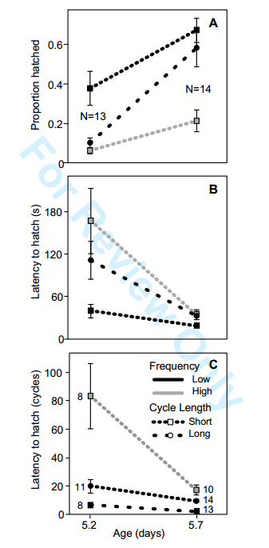

### A Brief Introduction


Arboreal embryos of red-eyed treefrogs, *Agalychnis callidryas*, hatch prematurely to escape from egg predators, cued by vibrations in attacks. Young embryos modulate hatching based on multiple frequency and temporal properties of cues, reducing false alarms that unnecessarily expose them to risk in the water. Because the cost of false alarms decreases developmentally we hypothesized that, if sampling costs are high or stimuli ambiguous, older embryos would accept more false alarms. 

### Methods, again briefly 


We assessed changes in sensitivity to sampling costs using vibration playbacks (to trays of embryos, pictured above, sideways) at two developmental stages. We designed sets of 3 stimuli, based on prior results with younger embryos, so one elicited high hatching and two elicited similarly low hatching, but sampling costs differed between low-hatching stimuli. 

### File logistics

The original paper and full dataset used are uploaded onto the repository in pdf and csv form, respectively. I will replicate all analyses included in the paper, including mann-whitney-wilcoxon tests, two-sample t-tests, wilcoxon rank sum tests, binomial GLMs, interaction plots, ANOVAs, and AIC model comparisons. 

A report of findings in paragraph form (as presented in the original paper) can be found at the end of the report. 

First, we will clear the environment and set our working directory: 

```{r}

rm(list=ls()) #clear environment
setwd('/Users/juliejung/Documents/GitHub/AN 597/data-reanalysis-assignment') #set working directory       

```

### User Defined Functions

Here we'll define some functions that will help us later: 

```{r}

#####################################################################
#########                f u n c t i o n s          #################
#####################################################################

```

The following function will give us the mode: 

```{r}
# gives mode
Mode <- function(x) {
  ux <- unique(x)
  ux[which.max(tabulate(match(x, ux)))]
}

```

The following function will give us the count, mean, standard deviation, standard error of the mean, and confidence interval (default 95%). Details are in annotations within script. 

Important Variables: 
     - data: a data frame.
     - measurevar: the name of a column that contains the variable to be summarized
     - groupvars: a vector containing names of columns that contain grouping variables
     - na.rm: a boolean that indicates whether to ignore NA's
     - conf.interval: the percent range of the confidence interval (default is 95%)

```{r}

summarySE <- function(data=NULL, measurevar, groupvars=NULL, na.rm=FALSE,
                      conf.interval=.95, .drop=TRUE) {
  library(plyr)
  # New version of length which can handle NA's: if na.rm==T, don't count them
  length2 <- function (x, na.rm=FALSE) {
    if (na.rm) sum(!is.na(x))
    else       length(x)
  }
  # This does the summary. For each group's data frame, return a vector with
  # N, mean, and sd
  datac <- ddply(data, groupvars, .drop=.drop,
                 .fun = function(xx, col) {
                   c(N    = length2(xx[[col]], na.rm=na.rm),
                     mean = mean   (xx[[col]], na.rm=na.rm),
                     sd   = sd     (xx[[col]], na.rm=na.rm)
                   )
                 },
                 measurevar
  )
  # Rename the "mean" column    
  datac <- rename(datac, c("mean" = measurevar))
  datac$se <- datac$sd / sqrt(datac$N)  # Calculate standard error of the mean
  # Confidence interval multiplier for standard error
  # Calculate t-statistic for confidence interval: 
  # e.g., if conf.interval is .95, use .975 (above/below), and use df=N-1
  ciMult <- qt(conf.interval/2 + .5, datac$N-1)
  datac$ci <- datac$se * ciMult
  return(datac)
}

```

### Preparation: Load packages

Here, we load packages that we'll need later on in the code. 

```{r}

library(curl)
#library(xlsx)
library(sciplot)
library(ggplot2)
library(MASS)
library(multcomp)
library(AICcmodavg)
library(car)

```

### Preparation: read in data

Next, we want to read in the relevant datafile (from the data-reanalysis-assignment repo) and show a few lines of raw data in your output (e.g., using head()).

```{r}

f <- curl("https://raw.githubusercontent.com/jamjulie/data-reanalysis-assignment/master/WarkentinJungRuedaMcDaniel-DataForDeposit.csv")
data <- read.csv(f, header = TRUE, sep = ",", stringsAsFactors = TRUE)
head(data)

```

### Results

The following results follow the order of presented results in the paper (pdf in repo). 

First, we will check there are at least 8 eggs per tray. 

```{r}
min(data$TestEggs, na.rm=T) 

```

Now let's look at the structure of our data, and make sure the variables are defined as we want them to be defined. 

```{r}
str(data)
data$GutCoilStage<-as.numeric(as.character(data$GutCoilStage))
data$T3length<-as.numeric(as.character(data$T3length))
data$ProportionHatched<-as.numeric(as.character(data$ProportionHatched))
data$STIMULUS<-as.factor(data$STIMULUS)
data$FirstHatch.s. <-as.numeric(as.character(data$FirstHatch.s. ))
data$FirstHatch.cycles. <-as.numeric(as.character(data$FirstHatch.cycles. ))

```

Here let's subset the data into 2 age groups: younger and older. 

```{r}

younger<-subset(data, Age.d.==5.2, na.rm=T)
older<-subset(data, Age.d.==5.7, na.rm=T)

```

Since the paper reports the mode of stages for each age category, let's find that: 

```{r}

Mode(younger$GutCoilStage)
Mode(older$GutCoilStage)
```

Here we'll create a table summary of statistics for hatching rates (in proportion hatched) for each age category, grouped by stimulus treatment. 

"summarySE"" is a user defined function, which you'll find above in the functions section. 

```{r}

younger_errorstats_g8 <- summarySE(younger, measurevar="ProportionHatched", groupvars="STIMULUS")
younger_errorstats_g8$AgeGroup<-"younger"

older_errorstats_g8 <- summarySE(older, measurevar="ProportionHatched", groupvars="STIMULUS")
older_errorstats_g8$AgeGroup<-"older"

```

Should we use parametric or non-parametric tests?

```{r}

hist(data$GutCoilStage) #non parametric
hist(younger$GutCoilStage)
hist(older$GutCoilStage)

```

We'll use mann-whitney-wilcoxon test because our 2 data samples (younger and older) are independent/come from distinct populations, so the samples do not affect each other. 

Also because our data are non-parametric. 

```{r}
wtest<-wilcox.test(data$GutCoilStage~data$Age.d., mu = 0, alt="two.sided", paired = F, conf.int=T, conf.level=0.95)
qnorm(wtest$p.value) #z-value to report
wtest
```

Moving right along, here we'll calculation the total lengths (mean and se) of hatchlings in each age group. 

```{r}

mean(younger$MeanLength)
mean(older$MeanLength)

se(younger$MeanLength)
se(older$MeanLength)

```

Since the data are normal and we get equal variances, we'll perform a t-test. 

```{r}
hist(data$MeanLength)#normal
var.test(younger$MeanLength, older$MeanLength) # equal variances
t.test(younger$MeanLength, older$MeanLength, alternative=c("two.sided"), paired=FALSE, var.equal=TRUE, conf.level=0.95)

```

We want to calculate some means and ses for spontaneous hatching before the test period. 

```{r}

mean(younger$AlreadyHatchedorRuptured)
se(younger$AlreadyHatchedorRuptured)
mean(older$AlreadyHatchedorRuptured)
se(older$AlreadyHatchedorRuptured)

```

Since the data are non-parametric, we'll perform a mann-whitney test: 

```{r}

hist(data$AlreadyHatchedorRuptured)#non-parametric, mann-whitney
wtest<-wilcox.test(data$AlreadyHatchedorRuptured~data$Age.d., mu = 0, alt="two.sided", paired = F, conf.int=T, conf.level=0.95)
qnorm(wtest$p.value) #z-value to report
wtest

```

We want to calculate some means and ses for the number of individuals that hatched before the test period. 

```{r}
# hatching from set up
mean(younger$HatchedinSetup)
se(younger$HatchedinSetup)
mean(older$HatchedinSetup)
se(older$HatchedinSetup)

```

Since the data are non-parametric, we'll perform a mann-whitney test: 

```{r}

hist(data$HatchedinSetup)#non-parametric, mann-whitney
wtest<-wilcox.test(data$HatchedinSetup~data$Age.d., mu = 0, alt="two.sided", paired = F, conf.int=T, conf.level=0.95)
qnorm(wtest$p.value) #z-value to report
wtest
```

We want to calculate some means and ses for the number of test eggs per tray in older vs. younger. 

```{r}

#smaller number of test eggs per tray in older than younger
mean(younger$TestEggs)
se(younger$TestEggs)
mean(older$TestEggs)
se(older$TestEggs)

min(younger$TestEggs)
max(younger$TestEggs)
min(older$TestEggs)
max(older$TestEggs)

```

Since the data are non-parametric, we'll perform a mann-whitney test: 

```{r}

hist(data$TestEggs)#non-parametric, mann-whitney
wtest<-wilcox.test(data$TestEggs~data$Age.d., mu = 0, alt="two.sided", paired = F, conf.int=T, conf.level=0.95)
qnorm(wtest$p.value) #z-value to report
wtest

```

Next, we want to know whether age, stimulus, and/or their interaction affected the hatching response of embryos in playbacks 

We'll do this by performing a binomial GLM: 
```{r}

#binomial glm
glm1<-glm(cbind(X10minHatch,TestEggs)~Age.d., family=binomial(logit), data=data)
glm2<-glm(cbind(X10minHatch,TestEggs)~STIMULUS, family=binomial(logit), data=data)
glm3<-glm(cbind(X10minHatch,TestEggs)~Age.d.+STIMULUS, family=binomial(logit), data=data)
glm4<-glm(cbind(X10minHatch,TestEggs)~Age.d.*STIMULUS, family=binomial(logit), data=data)

glms<-list(glm1, glm2, glm3, glm4)
aictab(glms)

Anova(glm4)

```

This is the plot for our proportion hatched data (Figure 6 in paper)

```{r}
interaction.plot(data$Age.d., data$STIMULUS, data$ProportionHatched, 
                 leg.bty="0", pch=c(18,24), 
                 ylab="Proportion hatched", 
                 xlab="Age (days)", 
                 trace.label="")

```


The image of the figure from the original paper that I'm replicating is included in a folder called “img” within my repo and embedded here: 

Specifically, we're looking at part A of the figure. 




ALTERNATIVELY, we can use ggplot to create a much prettier plot, with standard errors. Note that ideally the order of younger and older would be switched, but the data presented are the same as presented in the original paper. 

If I wanted to, I could switch this order by following the steps through this [link](https://stackoverflow.com/questions/3253641/change-the-order-of-a-discrete-x-scale):

```{r}

ggplot(data, aes(x=as.factor(AgeGroup), y=ProportionHatched, colour=STIMULUS)) + 
  geom_point(data=younger_errorstats_g8 , size=3) +
  geom_errorbar(data=younger_errorstats_g8, aes(ymin=ProportionHatched-se, ymax=ProportionHatched+se), width=0.05)+ 
  geom_point(data=older_errorstats_g8, size=3) +
  geom_line(data=older_errorstats_g8)+
  geom_errorbar(data=older_errorstats_g8, aes(ymin=ProportionHatched-se, ymax=ProportionHatched+se), width=0.05)+ 
  theme_bw(20)+
  ylab("Proportion of tray hatched\n")+
  xlab("\n Age group")

```

Moving on: Here we perform separate binomial GLMs at each age, with grouped categories of treatment stimuli. 

```{r}

#binomial glm for YOUNGER
glm2<-glm(cbind(X10minHatch,TestEggs)~STIMULUS, family=binomial(logit), data=younger)
Anova(glm2)

#binomial glm for OLDER
glm2<-glm(cbind(X10minHatch,TestEggs)~STIMULUS, family=binomial(logit), data=older)
Anova(glm2)

```

Latency Analysis: 

Because risk in predator attacks probably accrues as a function of time, 
but information from temporal properties accrues as a function of cycles 
we conducted analyses of latency measured both in time (seconds) 
and in cycles (dividing time by the cycle length of the stimulus). 

```{r}

min(data$FirstHatch.s., na.rm=T)
max(data$FirstHatch.s., na.rm=T)

data$FirstHatch.cycles.

```

Are our data parametric?

```{r}

hist(data$FirstHatch.s.) #nonparametric
hist(data$FirstHatch.cycles.) #nonparametric
hist(log(data$FirstHatch.s.)) #parametric!
hist(log(data$FirstHatch.cycles.)) #parametric!

```
Since they are, we can use ANOVAs of log-transformed data to test for 
effects of age, stimulus and age-by-stimulus interaction 
on the latency to hatch. 

```{r}
# IN SECONDS, Anova
aov1 <- aov(FirstHatch.s. ~ Age.d.*STIMULUS, data=data)
summary(aov1)
# IN CYCLES, Anova
aov2 <- aov(FirstHatch.cycles. ~ Age.d.*STIMULUS, data=data)
summary(aov2)

```


Alternatively, we can use GLMs: 

```{r}
# IN SECONDS, GLM METHOD
glm1<-glm(FirstHatch.s.~Age.d., family=gaussian(link = "identity"), data=data)
glm2<-glm(FirstHatch.s.~STIMULUS, family=gaussian(link = "identity"), data=data)
glm3<-glm(FirstHatch.s.~Age.d.+STIMULUS, family=gaussian(link = "identity"), data=data)
glm4<-glm(FirstHatch.s.~Age.d.*STIMULUS, family=gaussian(link = "identity"), data=data)

glms<-list(glm1, glm2, glm3, glm4)
aictab(glms)

Anova(glm4)

```


Here we plot the latencies for the first embryo in each tray to hatch: 

In order to do this, we'll get the SEs using our summarySE function. 

```{r}

LtoH_younger_errorstats_g8 <- summarySE(younger, measurevar="FirstHatch.s.", groupvars="STIMULUS", na.rm=TRUE)
LtoH_younger_errorstats_g8$AgeGroup<-"younger"

LtoH_older_errorstats_g8 <- summarySE(older, measurevar="FirstHatch.s.", groupvars="STIMULUS", na.rm=TRUE)
LtoH_older_errorstats_g8$AgeGroup<-"older"

```

Now we can make the plot! 

```{r}

ggplot(data, aes(x=as.factor(AgeGroup), y=FirstHatch.s., colour=STIMULUS)) + 
  geom_point(data=LtoH_younger_errorstats_g8 , size=3) +
  geom_errorbar(data=LtoH_younger_errorstats_g8, aes(ymin=FirstHatch.s.-se, ymax=FirstHatch.s.+se), width=0.05)+ 
  geom_point(data=LtoH_older_errorstats_g8, size=3) +
  geom_errorbar(data=LtoH_older_errorstats_g8, aes(ymin=FirstHatch.s.-se, ymax=FirstHatch.s.+se), width=0.05)+ 
  theme_bw(20)+
  ylab("Latency to hatch (seconds)\n")+
  xlab("\n Age group")

```


The image of the figure from the original paper that I'm replicating is included in a folder called “img” within my repo and embedded here: 

Specifically, we've replotted part B of this figure. 


Recall that because risk in predator attacks probably accrues as a function of time, 
but information from temporal properties accrues as a function of cycles, 
we conducted analyses of latency measured both in time (seconds) 
and in cycles (dividing time by the cycle length of the stimulus). 

```{r}
## IN CYCLES, GLM METHOD

glm1<-glm(FirstHatch.cycles.~Age.d., family=gaussian(link = "identity"), data=data)
glm2<-glm(FirstHatch.cycles.~STIMULUS, family=gaussian(link = "identity"), data=data)
glm3<-glm(FirstHatch.cycles.~Age.d.+STIMULUS, family=gaussian(link = "identity"), data=data)
glm4<-glm(FirstHatch.cycles.~Age.d.*STIMULUS, family=gaussian(link = "identity"), data=data)

glms<-list(glm1, glm2, glm3, glm4)
aictab(glms)

Anova(glm4)

```

The shortest latency times were for the LF stimulus (younger: 39.5 ± 10.1 s; older 18.6 ± 1.9 s), 
 while latencies for the LS stimulus included the fewest cycles of the vibration pattern 
(younger: 6.5 ± 1.6; older: 1.9 ± 0.3 cycles). 

```{r}

HF<-subset(data, STIMULUS=="HF", na.rm=T)
LF<-subset(data, STIMULUS=="LF", na.rm=T)
LS<-subset(data, STIMULUS=="LS", na.rm=T)

HFyounger<-subset(HF, Age.d.==5.2, na.rm=T)
HFolder<-subset(HF, Age.d.==5.7, na.rm=T)
LFyounger<-subset(LF, Age.d.==5.2, na.rm=T)
LFolder<-subset(LF, Age.d.==5.7, na.rm=T)
LSyounger<-subset(LS, Age.d.==5.2, na.rm=T)
LSolder<-subset(LS, Age.d.==5.7, na.rm=T)

mean(LFyounger$FirstHatch.s., na.rm=T)
se(LFyounger$FirstHatch.s., na.rm=T)
mean(LFolder$FirstHatch.s., na.rm=T)
se(LFolder$FirstHatch.s., na.rm=T)

mean(LSyounger$FirstHatch.cycles., na.rm=T)
se(LSyounger$FirstHatch.cycles., na.rm=T)
mean(LSolder$FirstHatch.cycles., na.rm=T)
se(LSolder$FirstHatch.cycles., na.rm=T)

```

We conducted analyses of latency both on the subset of trays from which at least one individual hatched and also on the full dataset, assigning a latency of 600 s (i.e., the full playback plus post-playback observation period) to trays in which no embryos hatched.

```{r}

# IN SECONDS, Anova
aov1 <- aov(FirstHatch.s.600 ~ Age.d.*STIMULUS, data=data)
summary(aov1)

# IN SECONDS, GLM METHOD
glm1<-glm(FirstHatch.s.600~Age.d., family=gaussian(link = "identity"), data=data)
glm2<-glm(FirstHatch.s.600~STIMULUS, family=gaussian(link = "identity"), data=data)
glm3<-glm(FirstHatch.s.600~Age.d.+STIMULUS, family=gaussian(link = "identity"), data=data)
glm4<-glm(FirstHatch.s.600~Age.d.*STIMULUS, family=gaussian(link = "identity"), data=data)

glms<-list(glm1, glm2, glm3, glm4)
aictab(glms)

Anova(glm4)


```


Here we plot the latencies for the first embryo in each tray to hatch IN CYCLES: 

In order to do this, we'll get the SEs using our summarySE function. 

```{r}

cycles_younger_errorstats_g8 <- summarySE(younger, measurevar="FirstHatch.cycles.", groupvars="STIMULUS", na.rm=TRUE)
cycles_younger_errorstats_g8$AgeGroup<-"younger"

cycles_older_errorstats_g8 <- summarySE(older, measurevar="FirstHatch.cycles.", groupvars="STIMULUS", na.rm=TRUE)
cycles_older_errorstats_g8$AgeGroup<-"older"

```

Now we can make the plot! 

```{r}

ggplot(data, aes(x=as.factor(AgeGroup), y=FirstHatch.cycles., colour=STIMULUS)) + 
  geom_point(data=cycles_younger_errorstats_g8 , size=3) +
  geom_errorbar(data=cycles_younger_errorstats_g8, aes(ymin=FirstHatch.cycles.-se, ymax=FirstHatch.cycles.+se), width=0.05)+ 
  geom_point(data=cycles_older_errorstats_g8, size=3) +
  geom_errorbar(data=cycles_older_errorstats_g8, aes(ymin=FirstHatch.cycles.-se, ymax=FirstHatch.cycles.+se), width=0.05)+ 
  theme_bw(20)+
  ylab("Latency to hatch (cycles)\n")+
  xlab("\n Age group")

```


The image of the figure from the original paper that I'm replicating is included in a folder called “img” within my repo and embedded here: 

Specifically, we've replotted part C of this figure. 


### Report of results

Younger embryos showed a range of stages from intact yolks to curved furrows while older embryos had straight furrows to full coils (N = 39 and 42; modes: straight furrow(1) and full coil(3); Wilcoxon test, Z=6.606223, P =1.97e-11). Embryos grew between test ages. Hatchling total length increased from 11.1 ± 0.07 to 11.6 ± 0.05 mm (mean ± SE, N = 39 and 42 trays respectively; t-test, t79 = 6.4871, P =7.018e-9; Fig. 4B). Embryos also hatched spontaneously between test ages. From trays tested, more of the older embryos had hatched spontaneously before the test period (0.9 ± 0.1 vs. 0.5 ± 0.1 embryos per tray; Wilcoxon test, Z=2.439, P = 0.0074) and relatively fewer of the trays with older eggs had sufficient individuals to attempt setup (KMW unquantified personal observation). In addition, more of the older embryos hatched during setup and acclimation (2.5 ± 0.3 vs. 0.9 ± 0.2 per tray; Wilcoxon test, Z=404.5, P = 5.085e-5), resulting in smaller numbers of test eggs per tray (Wilcoxon test, Z=4.361872, P =6.448e-6; older 11.5 ± 0.3, younger 13.5 ± 0.2, range 8–15 at both ages). 

Age, stimulus, and their interaction affected the hatching response of embryos in playbacks (Fig. 6A). Older embryos hatched more than did younger ones (binomial GLM, age effect: χ2 = 107.71, df = 1, P < 0.0001), and the LF stimulus elicited the strongest hatching response (stimulus effect: χ2 = 57.57, df = 2, P < 0.0001). However, the significant age × stimulus interaction revealed that the developmental increase in hatching was not uniform across stimuli (interaction effect: χ2 = 12.55, df = 2, P = 0.0019). Younger embryos showed equally little response to both the HF and LS stimuli but a substantial hatching response to the LF stimulus (Fig. 6A, stimulus effect: χ2 = 57.57, df = 2, P < 0.0001; HF–LS contrast χ2  = 1.48, P = 0.22; (HF+LS)–LF contrast χ2 = 370 56.75, P < 0.0001). In contrast, older embryos showed similarly strong hatching responses to both LF and LS stimuli and a weaker response to the HF stimulus (stimulus effect: χ2 = 73.84, df = 2, P < 0.0001; LF–LS contrast χ2 = 2.46, P = 0.12; (LF+LS)–HF contrast χ2 = 71.61, P < 0.0001). 

In trays where hatching occurred, the latency until the first embryo hatched ranged from 9–420 s. Latency varied among stimuli and decreased with age, with a marginally non-significant interaction effect (Fig. 6B,C). This pattern held whether measuring latency in seconds or in cycles of vibration (seconds: age, F1,58 = 44.07, P < 0.0001; stimulus, F2,58 = 13.88, P < 0.0001; interaction, F2,58 = 2.91, P = 0.0625; cycles: age, F1,58 = 44.05, P < 0.0001; stimulus, F2,58 = 31.78, P < 0.0001; interaction, F2,58 = 2.91, P = 0.0625). The shortest latency times were for the LF stimulus (younger: 39.5 ± 10.1 s; older 18.6 ± 1.9 s), while latencies for the LS stimulus included the fewest cycles of the vibration pattern (younger: 6.5 ± 1.6; older: 1.9 ± 0.3 cycles). If we assign a latency of 600 s to trays in which no embryos hatched, age and stimulus effects remain strong and the interaction effect is much weaker (latency in seconds: age, F1,75 = 27.98, P < 0.0001; stimulus, F2,75 = 7.77, P = 0.0009; interaction F2,75 = 0.75, P = 0.47). 

### Discussion 
Older embryos showed lower latency to hatch, indicating less cue sampling, and more hatching overall. Their similarly high responses to two of the stimuli suggest they ceased to discriminate using slow-to-assess properties as indicators of safety; however, they showed little hatching if either frequency spectrum or a fast temporal pattern allowed rapid assessment of low risk. 

### Conclusion
Developmental changes in behavior due to ontogenetic adaptation of decision processes are likely to be widespread. Vibration-cued hatching allows us to use the power of playback experiments to improve our understanding of the development of adaptive embryo behavior.

